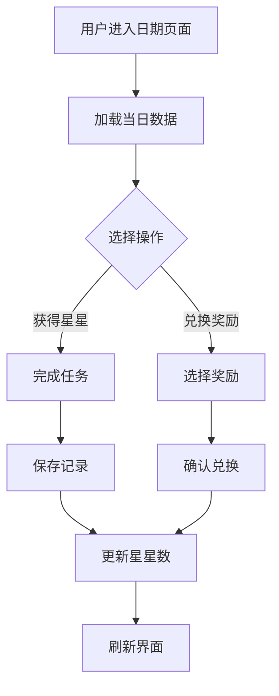

# 小星星学习记录 - 功能优化说明

## 🚀 本次优化内容

### 1. 日期记录页面重构 (`pages/day/[date].vue`)

#### ✨ 新增功能
- **选项卡设计**：将页面分为"获得星星"和"兑换奖励"两个模块
- **星星收支统计**：显示当日获得、消耗和净增的星星数
- **快速兑换**：直接在日记录页面兑换奖励
- **今日兑换记录**：查看当天的奖励兑换历史

#### 🎨 界面优化
- **更简洁的布局**：减少视觉拥挤，提升用户体验
- **紧凑的卡片设计**：缩小间距，内容更聚焦
- **响应式改进**：在移动端有更好的显示效果
- **一致的按钮风格**：统一交互体验

#### 📊 数据展示改进
- **星星收支明细**：清晰显示获得 (+) 和消耗 (-) 的星星数
- **实时更新**：兑换奖励后即时刷新数据
- **动画效果**：成功操作后的友好提示

### 2. 新增 API 接口

#### 📡 `GET /api/redeemed-rewards`
- **功能**：获取奖励兑换记录
- **参数**：
  - `date` (可选): 按特定日期过滤记录
- **返回**：兑换记录列表

### 3. 数据库优化

#### 📝 新增数据脚本 (`scripts/seed-rewards.sql`)
- **25个测试奖励**：覆盖不同星星消耗等级
- **分类完整**：低成本、中等、高级、超级奖励
- **更多任务数据**：丰富的预设任务选择

### 4. 类型定义完善

#### 🔧 新增类型 (`types/index.ts`)
```typescript
export interface RedeemedReward {
  id: string;
  reward_name: string;
  reward_description: string | null;
  stars_cost: number;
  redeemed_at: string;
}
```

## 🎯 用户体验改进

### 操作流程优化
1. **日记录页面**：
   - 点击"获得星星"选项卡记录学习成果
   - 点击"兑换奖励"选项卡快速兑换
   - 所有操作在一个页面完成

2. **星星管理**：
   - 直观的收支统计
   - 实时的余额更新
   - 清晰的操作反馈

3. **奖励系统**：
   - 快速兑换常用奖励
   - 完整奖励中心管理
   - 兑换历史追踪

### 界面设计原则
- **儿童友好**：大图标、明亮配色、简单操作
- **信息层次**：重要信息突出，次要信息收起
- **一致性**：统一的设计语言和交互模式
- **响应式**：适配不同屏幕尺寸

## 🛠️ 技术改进

### 性能优化
- **并行加载**：同时加载多个数据源
- **组件复用**：共用星星显示组件
- **事件监听**：全局星星更新事件

### 代码组织
- **模块化设计**：功能明确分离
- **类型安全**：完整的 TypeScript 支持
- **错误处理**：友好的错误提示

## 📱 使用指南

### 日常使用流程
1. **记录学习**：选择"获得星星"，完成任务获得星星
2. **兑换奖励**：选择"兑换奖励"，用星星换取心仪奖励
3. **查看历史**：在奖励选项卡查看今日兑换记录
4. **管理奖励**：在奖励中心页面管理所有可用奖励

### 快捷操作
- **右上角奖励按钮**：直接跳转到奖励中心
- **星星数实时显示**：页面头部始终显示当前星星余额
- **一键兑换**：在日记录页面直接兑换常用奖励

## 🎨 界面截图说明

### 优化前 vs 优化后
- **布局更紧凑**：减少了不必要的空白
- **功能更集中**：相关功能组织在一起
- **操作更便捷**：减少页面跳转次数

### 新增功能亮点
- **选项卡设计**：清晰分离获得和消耗操作
- **收支统计**：直观显示星星变化
- **快速兑换**：提升奖励兑换效率

## 🔄 数据流程



## 🚀 下一步计划

### 功能扩展
- [ ] 添加学习目标设置
- [ ] 增加成就系统
- [ ] 支持多儿童管理
- [ ] 导出学习报告

### 界面优化
- [ ] 深色模式支持
- [ ] 更多动画效果
- [ ] 个性化主题
- [ ] 语音播报功能

---

> 📝 **说明**：本次优化主要解决了界面拥挤和缺少奖励兑换功能的问题，使应用更加实用和美观。 